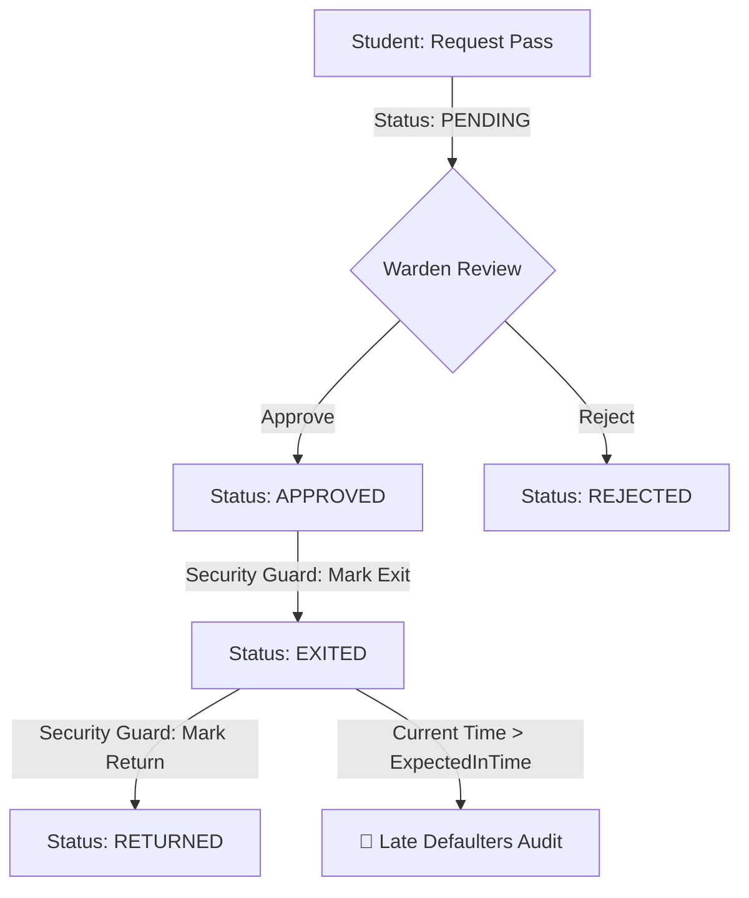

# 🚀 Digital Hostel Out-Pass (Gatepass) System

A minimal, unbreakable, and highly impactful micro-project built for technical interviews and placement demonstrations. 
It solves a universal campus problem—replacing easily lost paper gatepasses with a digital state-machine system—while proving mastery over state changes, role-based security logic (Student, Warden, Security Guard), late-return detection, and clean Java code.

---

## ✨ Features & Architecture



### 🎯 Core Capabilities
1. **Lifecycle State Machine**: Enforces strict state transitions (`PENDING` → `APPROVED` → `EXITED` → `RETURNED`). Any illegal transition (e.g., exiting on a `REJECTED` or `PENDING` pass) immediately throws a controlled HTTP `409 Conflict` error.
2. **Role-Based Logic**:
   - **Student**: Requests out-passes with exit and expected return timestamps.
   - **Warden**: Reviews pending passes and updates status (`APPROVED` / `REJECTED`).
   - **Security Guard**: Marks physical exit (`markExit`) and campus return (`markReturn`), recording `actualInTime`.
3. **Late-Return Detection (`getDefaulters`)**:
   - Automatically scans active passes where status is `EXITED` and the current timestamp is past `expectedInTime`.
4. **Interactive Dashboard**:
   - Built-in UI with dark mode and glassmorphism accessible at `/` for real-time demonstration.

---

## 🔒 Strict Engineering Constraints

* **100% Traditional Indexed `for` Loops Only**:
  To demonstrate low-level algorithmic discipline and avoid syntactic sugar hiding iteration overhead, this project **never uses enhanced `for-each` loops or Java Streams**. Every iteration in the service layer, helper methods, and unit tests uses explicit indexed loops:
  ```java
  for (int i = 0; i < allPasses.size(); i++) {
      OutPass pass = allPasses.get(i);
      // evaluation logic...
  }
  ```

---

## 🛠️ Technology Stack
- **Backend**: Java 17 / 21, Spring Boot 3.2, Spring Web
- **Persistence**: Spring Data JPA, H2 In-Memory Database (`jdbc:h2:mem:outpassdb`)
- **Testing**: JUnit 5, Mockito, SpringBootTest + MockMvc
- **Frontend**: Vanilla HTML5, CSS3 (Glassmorphism, Dark Mode), JavaScript (Fetch API)

---

## 🚀 Running Locally

```bash
# Clone the repository
git clone https://github.com/ABHIONWORK/digital-hostel-outpass-system.git
cd digital-hostel-outpass-system

# Run the complete test suite (Unit & Integration tests)
./mvnw clean test

# Start the application
./mvnw spring-boot:run
```

Open your browser and navigate to:
* **Interactive UI**: `http://localhost:8080/`
* **H2 Console**: `http://localhost:8080/h2-console` (JDBC URL: `jdbc:h2:mem:outpassdb`, User: `sa`, Password: *empty*)

---

## 📡 API Endpoints Reference

| Method | Endpoint | Description | Payload Example |
| :--- | :--- | :--- | :--- |
| `POST` | `/api/outpass/request` | Request a new out-pass | `{"studentId":"STU-101", "reason":"Hackathon", "outTime":"...", "expectedInTime":"..."}` |
| `PUT` | `/api/outpass/{id}/status` | Warden approve/reject | `{"status": "APPROVED"}` |
| `POST` | `/api/outpass/{id}/exit` | Guard marks exit | None |
| `POST` | `/api/outpass/{id}/return` | Guard marks return | None |
| `GET` | `/api/outpass/defaulters` | Get late exited students | None |
| `GET` | `/api/outpass` | List all out-passes | None |
